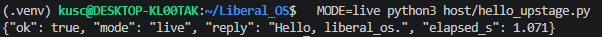
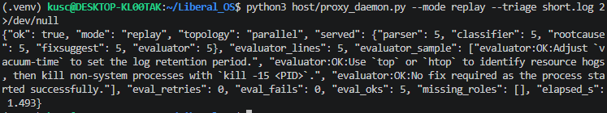
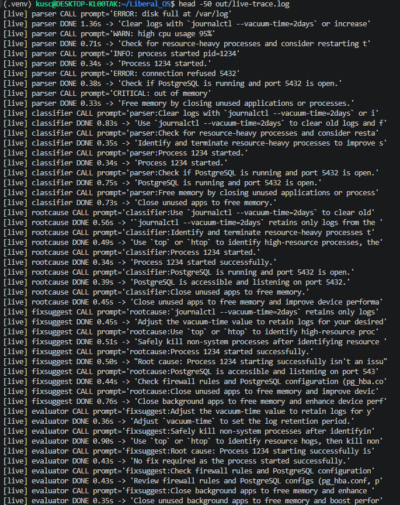
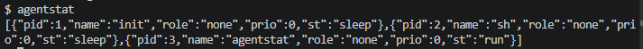
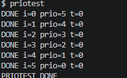
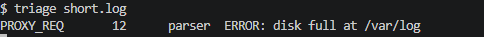
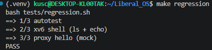

# Liberal_OS — xv6 기반 LLM 멀티에이전트 OS

> 2026 봄 OS 강좌 팀 프로젝트 · 방향 **A (OS for LLM)**
> 상세 설계·구현·평가는 **[`docs/TECHNICAL_REPORT.md`](docs/TECHNICAL_REPORT.md)**, 자율 개발 하네스는 **[`HARNESS.md`](HARNESS.md)** 참조.

---

## 한 줄 핵심

> **"API를 Python `multiprocessing`으로 호출"이 아니라 — LLM 에이전트 *프로세스* 를 직접 수정한 xv6 커널이 격리·스케줄·검증·캐싱한다.**

5종 LLM 에이전트(parser → classifier → root-cause → fix-suggester → evaluator)를 xv6 프로세스로 띄워 로그를 트리아지하고, 모든 오케스트레이션을 Linux 라이브러리(`multiprocessing`/`cgroups`)가 아니라 **직접 수정한 xv6 커널**(`proc.c`, `console.c`, `syscall.c`, `verifier.c`, `cache.c` …)로 구현했다.

## 구조도

```
┌──────────────────────────── Linux host ────────────────────────────┐
│  host/proxy_daemon.py ──(OpenAI 호환)──►  Upstage Solar Pro 3        │
│     mock = echo · replay = cache · live = 실 API                     │
└──────────▲───────────────│──────────────────────────────────────────┘
           │ PROXY_RES      │ PROXY_REQ        (QEMU -nographic 콘솔 시리얼)
┌──────────│────────────────▼───────────── xv6 guest (QEMU riscv64) ───┐
│  triage (오케스트레이터) ── fork + pipe 체인 ──►                      │
│    parser → classifier → root-cause → fix-suggester → evaluator      │
│                                               │ proxy_call()         │
│  ════════ kernel (직접 수정) ══════════════════╪════════════════════  │
│   • proc 메타데이터(agent_role/priority)   • priority scheduler       │
│   • sleeplock(console/proxy 직렬화)                                   │
│   • verifier.c  ▸ Pattern A: 검증→롤백        ── 시스콜 27–29         │
│   • cache.c     ▸ Pattern B: FNV+MinHash+/cache.bin ── 시스콜 30–32   │
└──────────────────────────────────────────────────────────────────────┘

proxy_call() 흐름:
  ① 커널 캐시 먼저 조회 ─ hit이면 LLM 호출(PROXY_REQ) 생략(CACHE_HIT)
  ② miss면 PROXY_REQ 송출 → 응답 수신 → 캐시에 저장
  ③ evaluator의 수정 제안은 커널 verifier가 검증 ─ FAIL이면 롤백 후 재시도
```

## 직접 구현한 OS 메커니즘 (요약)

GuideLine §2가 요구하는 "OS 컴포넌트는 직접 설계·구현"을 **7개 핵심 개념 + 3개 신규 커널 서브시스템**으로 충족한다.

| 분류 | 내용 |
|---|---|
| 핵심 7종 | 프로세스 관리(proc 메타) · IPC(pipe + 라인 프레이밍) · 동기화(sleeplock) · 스케줄링(priority) · 시스템 콜 · 프로세스 격리 |
| **Pattern A** | **검증+롤백 닫힌 루프** — `kernel/verifier.c`(정수 전용 순수 검증기) + 시스콜 `verifyfix(27)`/`checkpoint(28)`/`restore(29)`. LLM은 *제안자*, 최종 권한은 커널 |
| **Pattern B** | **커널 시맨틱 캐시 단락** — `kernel/cache.c`(FNV-1a exact + MinHash 의역 매칭 + `/cache.bin` 디스크 오버레이) + 시스콜 `cacheget(30)`/`cacheset(31)`/`cacheclear(32)`. hit 시 LLM 호출 생략 |
| **메모리 관리 / 자원 제어** | **프로세스별 메모리 쿼터** — `kernel/proc.{h,c}`·`sysproc.c`에서 각 에이전트 프로세스의 resident heap을 상한. `growproc()`이 쿼터 초과 `sbrk`를 거부(-1 + `AGENT_LOG`), 시스콜 `setquota(33)`로 상한 설정(0=무제한), fork가 상한 상속. `agentstat`에 `rss_kb`/`quota_pg`/`qdenied` 노출 |

신규 시스콜 **12종(22–33)**, 신규 커널 파일 `verifier.{c,h}`·`cache.{c,h}`, 프로세스별 메모리 쿼터(`setquota(33)`).
👉 10행 전체 매핑표·설계 근거·측정치는 **[`docs/TECHNICAL_REPORT.md`](docs/TECHNICAL_REPORT.md) §3 · §10.8**.

## 빠른 시작

```bash
# 0) 빌드 의존성(Ubuntu/WSL2) + Python venv — 상세는 TECHNICAL_REPORT Appendix B
sudo apt install -y gcc-riscv64-linux-gnu gdb-multiarch qemu-system-misc make python3 python3-venv
python3 -m venv .venv && . .venv/bin/activate && pip install -r host/requirements.txt

# 1) end-to-end (네트워크·키 불필요) — xv6 부팅 + 5단계 트리아지
python3 host/proxy_daemon.py --mode mock --triage short.log

# 2) 회귀 게이트(6단계: 부팅·셸·proxy·Pattern A·Pattern B·2-패턴 증거)
make regression

# 3) xv6 셸 직접 시연
make qemu        # 셸에서: agentstat / priotest / triage short.log
```

상세 실행 모드(live / replay / sequential, 타임아웃·sanitize 주의)와 셋업 트러블슈팅: **TECHNICAL_REPORT Appendix B**.

## 데모 — 시각 증거

스크린샷은 모두 `out/screenshots/`. (촬영: 2026-06-08, Pattern A/B 도입 이전 라이브 데모 — 두 패턴 자체의 증거는 텍스트 트랜스크립트 [`docs/patterns_demo.txt`](docs/patterns_demo.txt) 참조.)

| # | 파일 | 명령 | 무엇을 증명 |
|---|---|---|---|
| 1 | `screenshot1.png` | `MODE=live python3 host/hello_upstage.py` | Upstage Solar Pro 3 단일 호출 round-trip (`elapsed_s ≈ 1.07s`) |
| 2 | `screenshot2.png` | `proxy_daemon.py --mode replay --triage short.log` | 5-stage × 5-line = **25 LLM 호출 완주**, `ok:true`, `missing_roles:[]` |
| 3 | `screenshot3.png` | `head -50 out/live-trace.log` | 25 호출 per-call `CALL → DONE` trace — §2 "thin wrapper 아님" 증거 |
| 4 | `screenshot4.png` | `agentstat` (xv6 셸) | 신규 시스콜 + `struct proc` 메타 필드 |
| 5 | `screenshot5.png` | `priotest` (xv6 셸) | 수정 `scheduler()`가 우선순위 존중 (ρ = −1.000) |
| 6 | `screenshot6.png` | `triage short.log` (xv6 단독) | parser 자식이 raw PROXY_REQ emit — fork+pipe 진입 |
| 7 | `screenshot7.png` | `make regression` | 자동 회귀 게이트 PASS (촬영 시점 3-stage; 현재 **6-stage**로 확장) |


*Solar Pro 3 단일 round-trip (`≈1.07s`, mock의 0.05s 대비 ~20×).*


*5-stage 에이전트가 fork+pipe로 연결된 채 호스트 daemon을 통해 **5 × 5 = 25회** round-trip. `served:{parser:5,…,evaluator:5}`, `missing_roles:[]`, `eval_oks:5`. §3 표의 모든 OS 메커니즘이 실 LLM 호출과 함께 동작.*


*`out/live-trace.log`: 각 `CALL → DONE` 쌍이 실제 Upstage 요청 1회 — "thin wrapper 아님"의 정면 반증.*


*`agentstat(23)`이 `struct proc` 메타 필드(`role`,`prio`,`st`)를 JSON 한 줄로 dump.*


*수정 `scheduler()`가 `setprio(2)` priority를 존중: 6 자식이 5→0 순 종료 (ρ = −1.000).*


*host daemon 없이도 `parser` 자식이 raw PROXY_REQ 프레임 emit — fork+pipe 첫 단계 진입.*


*자동 회귀 게이트 PASS (촬영 시점 3/3; 현재는 Pattern A/B 테스트 포함 6단계).*

전체 흐름 텍스트 트랜스크립트: [`docs/demo_transcript.txt`](docs/demo_transcript.txt) (부팅 → `agentstat` → `triage` → `priotest`), 두 패턴 e2e 증거: [`docs/patterns_demo.txt`](docs/patterns_demo.txt).

---

## 마무리 — 산출물 · 구조 · 더 읽기

**최종 산출물 (GuideLine §5)**

| # | 산출물 | 위치 |
|---|---|---|
| 1 | Application | 본 저장소(`xv6-src/`, `host/`) + `make qemu` 시연 |
| 2 | Technical Report | [`docs/TECHNICAL_REPORT.md`](docs/TECHNICAL_REPORT.md) + [`out/REPORT.md`](out/REPORT.md) |
| 3 | Development Process Document | [`PROCESS.md`](PROCESS.md) |
| 4 | Presentation Slides (영어) | [`slides/draft.md`](slides/draft.md) |

**디렉토리**

```
liberal_os/
├── xv6-src/   # 수정한 xv6 (kernel: proc/console/syscall/verifier/cache · user: triage·5 agents·…)
├── host/      # proxy_daemon.py (mock/replay/live) + hello_upstage.py
├── tests/     # autotest.sh · regression.sh · test_verifier.sh · test_cache.sh
├── bench/     # run_all.sh · report.py · capture_patterns.py
├── docs/      # TECHNICAL_REPORT.md · patterns_demo.txt · demo 자료
├── samples/   # 입력 로그(short.log)
└── out/       # 벤치·스크린샷 출력(gitignore)
```

**한계 (요약)** — LLM 호출은 `proxylock`으로 직렬화(진정한 병렬 API 호출은 future work) · 5단계 DAG는 정적. 자세한 한계·향후 작업은 [`docs/TECHNICAL_REPORT.md`](docs/TECHNICAL_REPORT.md) §11·§12.

**더 읽기** — 설계·일정 [`MASTER_PLAN.md`](MASTER_PLAN.md) · 운영 매뉴얼 [`CLAUDE.md`](CLAUDE.md) · 진행 상태 [`STATUS.md`](STATUS.md) · 자율 하네스 [`HARNESS.md`](HARNESS.md) · 이슈 이력 [`PROCESS.md`](PROCESS.md).
